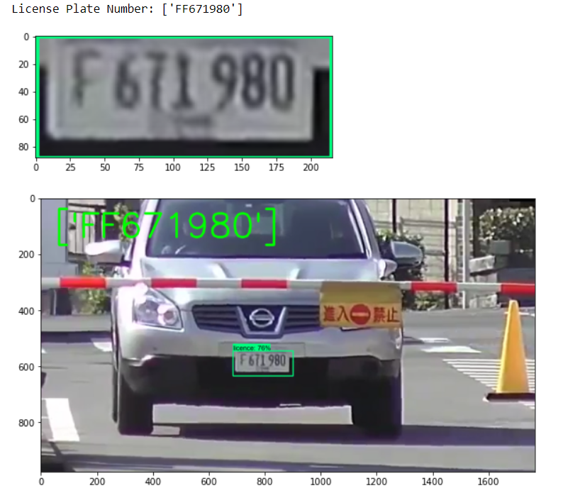
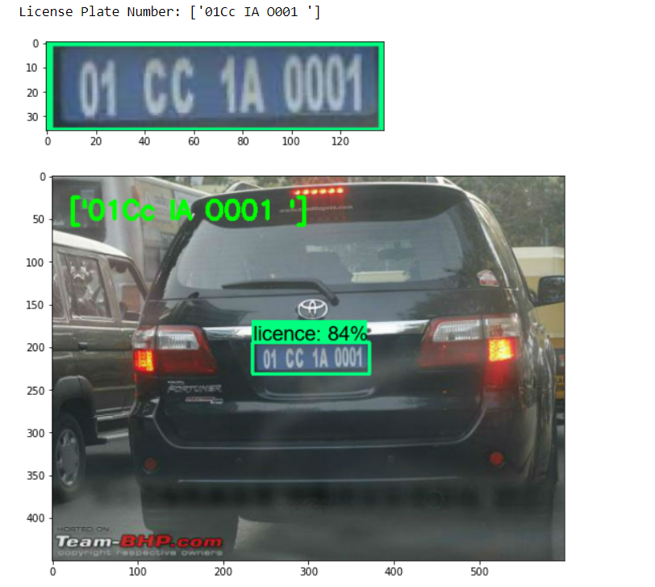
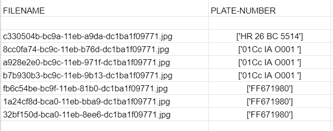
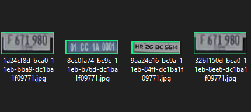
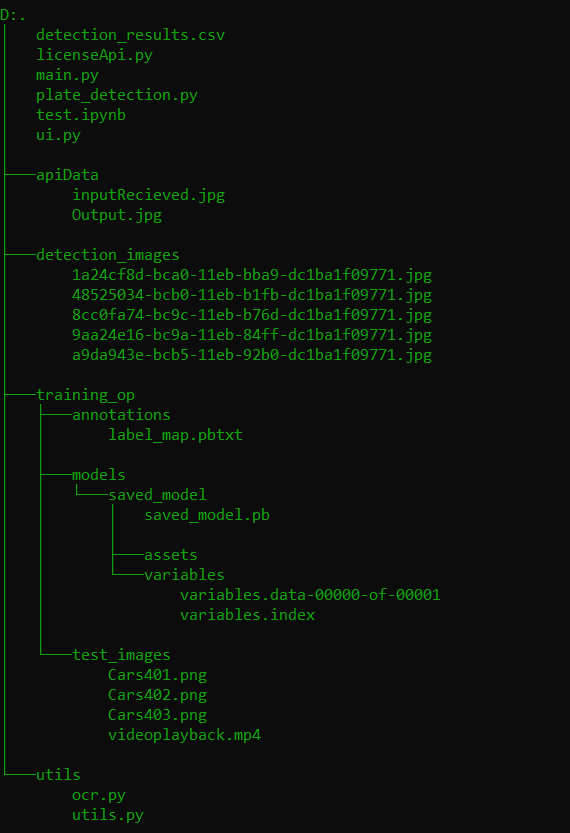
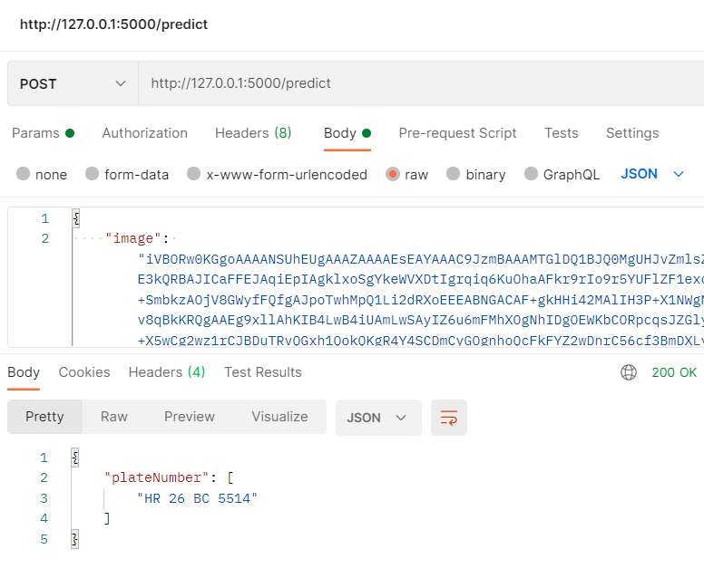

# ANPR-Surveillance
Automatic number plate Recognition built with various Object detection models and OCR for recognition and keeping track of vehicles in and out.

## Demo
 

## Demo Video
https://user-images.githubusercontent.com/71146670/119549168-95356700-bdb4-11eb-97c8-088cedbe77fe.mp4

## Output Saved as...
 

# How to Run
#### 1. Create Virtual Environment.(Python==3.8)
#### 2. Install requirements(requirements.txt)
#### 3. Run main.py(Look into comments and run accordingly)
#### 4. If API required run licenseApi.py(restful Api you can directly use in your application):
####       Just pass image in base64 format to API and it'll do the job.
#### 5. Results are saved in detection_results.csv and detection_images folder.

## API output and Folder Tree(For easy navigation)
 

